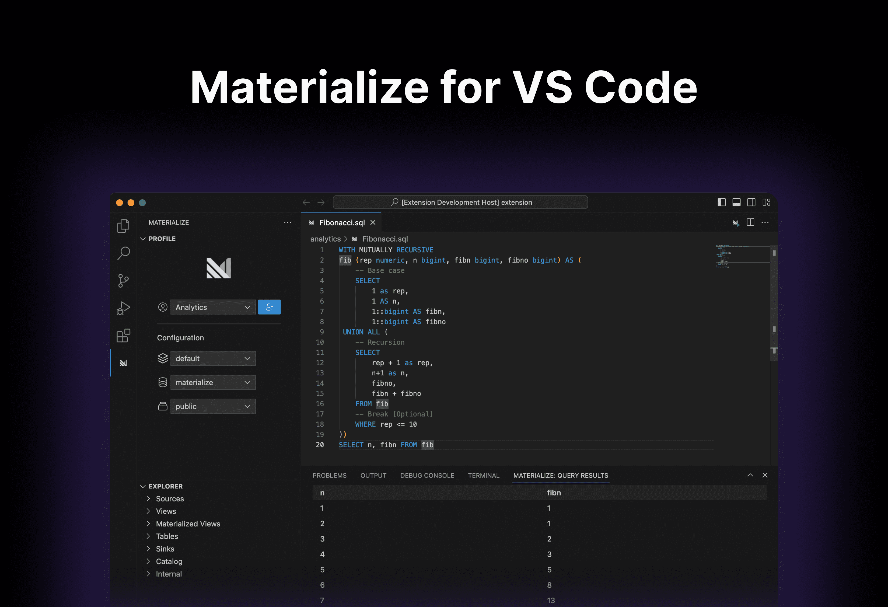
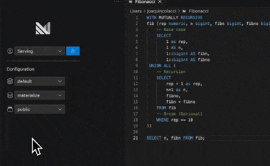

# Materialize extension for Visual Studio Code

The Materialize extension lets you connect, explore and query Materialize.

## Features

* [Profiles](#profiles)
    * Add and switch between profiles.
    * Configure the database, schema, or cluster.
* [Schema explorer](#schema-explorer)
    * Browse through your catalog.
* [SQL execution](#sql-execution)
    * Run `.sql` code (`⌘ Cmd + ⤶ Enter`) on your Materialize account and view the results in Visual Studio Code.

### Profiles

The extension authenticates and creates a profile using the web browser. As a user you can add and switch between profiles or change any runtime configuration, like cluster, database, or schema, at any time given.

### Schema explorer

The extension explorer enables you to browse through your schema. Also provides access to the internal schemas `mz_catalog` and `mz_internal`.

### SQL execution

The extension provides a way to run SQL code inside `.sql` files.
Run the SQL code from two ways:
* Using the shortcut (⌘ Cmd + ⤶ Enter).
* Pressing the Materialize icon in the editor toolbar.

## Contributing

For more information on contributing, please refer to the [CONTRIBUTING.md](https://github.com/MaterializeInc/vscode-extension/blob/main/CONTRIBUTING.md) document.
